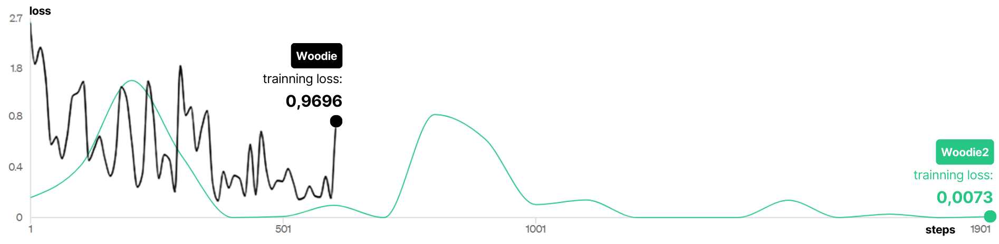

# Study on the Application of Fine-tuning in Educational Robotics 

This repository hosts a comprehensive study that investigates the convergence between <b>Artificial Intelligence (AI)</b> and <b>educational robotics</b>, proposing the use of <b><i>fine-tuning</i></b> as a solution to the challenges faced by teams in this context. From conception to current advancements, AI plays a fundamental role in society, and educational robotics, focused on <b><i>STEM</i></b>, adopts innovative practices to educate students but faces obstacles such as resource scarcity and disparities in competitions.

## Objective 🎯
The main goal of this work is to explore the application of fine-tuning as a tool to disseminate knowledge equitably among educational robotics teams. We aim to overcome obstacles, drive development, and strengthen the community through this innovative approach.

All codes and files related to the development of the application can be found here.

## Development 🔨

The project is divided into three main parts:

1. **<i>Backend</i>:** Consumes the model created through the OpenAI <i>API</i> and exposes a route via <i>fastify</i> for connection with the <i>frontend</i>. It also handles business logic, such as data validation and information transmission.

2. **<i>Frontend</i>:** Responsible for user interaction with the trained model, as well as the insertion of team information. Specific components were created for each part using <i>React hooks</i> to manage states and send data in requests to the <i>backend</i>.


3. **<i>Fine-tuning:</i>** Here, the fundamentals of <i>Machine Learning</i> are applied, along with the best practices recommended by <a href="#openai">OpenAI</a>.

    First, data on the topic was collected and generated;
    
    Then, the data was split into 70% for training and 30% for testing;
    
    Next, the data was structured as specified in the OpenAI documentation (see the example below or <a href="https://github.com/jvoliveirag/TCC/blob/main/fine_tuning/data/training_data.jsonl">click here</a> to view the entire file [in portuguese])

      ~~~JSON
      {"messages": [{"role": "system", "content": "You are a technical assistant helping a FIRST LEGO League team in the robot design process, which includes assembly with LEGO pieces (wheels, sensors, controllers, etc.), block programming, mission table strategy, documentation, presentation, continuous improvement, critical thinking, proactivity, and teamwork."}, {"role": "user", "content": "How can we adjust the PID controller settings to meet the specific needs of our robot, considering the mission strategy?"}, {"role": "assistant", "content": "Conduct practical tests, collect performance data, and adjust the PID parameters based on the results to optimize robot control."}]}
      ~~~

    * After that, the data was validated, and some metrics were generated, such as (example file - generated in the first training):

      ```
      Num samples: 196
      No errors found
      Num examples missing system message: 0
      Num examples missing user message: 0

      Distribution of num_messages_per_example:
      min / max: 3, 23
      mean / median: 3.4591836734693877, 3.0
      p5 / p95: 3.0, 3.0

      Distribution of num_total_tokens_per_example:
      min / max: 65, 761
      mean / median: 121.99489795918367, 106.0
      p5 / p95: 83.0, 135.0

      Distribution of num_assistant_tokens_per_example:
      min / max: 18, 450
      mean / median: 58.755102040816325, 44.0
      p5 / p95: 33.0, 86.5

      0 examples may be over the 4096 token limit, they will be truncated during fine-tuning
      Dataset has ~23911 tokens that will be charged for during training
      By default, you'll train for 3 epochs on this dataset
      By default, you'll be charged for ~71733 tokens''
      ```

    * With the data validated, the <code>.jsonl</code> file is uploaded to the OpenAI environment, where the new model will be trained;

    * Finally, the model is trained based on the uploaded data, and it becomes available for use in the OpenAI <i>playground</i> or as an <i>API</i>, which is the case for this project.

    <b><u>Note:</u></b> It is important to highlight that <i>fine-tuning</i> (<i><a href="https://www.leewayhertz.com/parameter-efficient-fine-tuning/">PEFT</a></i>) allows for the use of smaller amounts of data for training the model.

    ***Metrics***

    The following graph represents the loss during the training of the first (Woodie) and the last (Woodie2) models generated.

    

    The graph shows the losses (y-axis) during the training, with significant variation observed over the "steps" (x-axis). The final result, close to 1 **(0.9696 for 581 steps)**, shows an upward trend followed by a decline, indicating that it's still possible to significantly reduce losses and approach the ideal value (0), which is already observable in the second graph **(0.0073 for 1901 steps)**.


## Running locally ⚙️

1. Clone this repository;

2. Create a new file <code>.env</code> to insert your credentials:
    ~~~javascript
    //BACKEND
    DATABASE_URL= "your_db_url" //I used a container with postgresql
    OPENAI_KEY = "your_api_key_here"

    MAIL_USER = "your_mailing_service_user" //optional
    MAIL_PASS = "your_mailing_service_password" //optional
    ~~~

    ~~~javascript
    //FINE-TUNING
    OPENAI_KEY = "your_api_key_here"
    FILE_ID = "file_to_uploaded_id"
    ~~~

    ~~~javascript
    //FRONTEND
    VITE_AUTH0_DOMAIN = "your_auth0_domain"
    VITE_AUTH0_CLIENT_ID = "your_auth0_client_id"
    ~~~

    2.1 You can also create two other <code>.env</code> in order to better organize your files and separete them in: <code>.env.production</code> and <code>.env.development</code>

    ~~~javascript
    VITE_AUTH0_CALLBACK_URL = <callback_url_of_your_env_prod_or_dev>
    VITE_CONNECTION_SERVER = <server_url_of_your_env_prod_or_dev>
    ~~~

3. Next, to install the dependencies, in the /frontend and /backend directories - for each one - run:

    ```
    npm install
    ```

4. Start your database. 

    **Note.:** If you are using docker remember to get the image of your prefered db (which is set in <code>schema.prisma</code> as "provider") and insert the correct url for the database on your backend <code>.env</code> file run on your terminal:
    ```
    docker run <container_id>
    ```
    or just press the play button on docker desktop interface.

5. To start communication with the database (abstraction - <i>ORM</i>):

    ```
    npx prisma studio
    ```

6. Then, run the following command to start the application (both for <i>front</i> and <i>backend</i>):

    ```
    npm run dev
    ```

After these steps, the application will be ready to use. Click <a href="https://youtu.be/bqWryQXb0RM">here</a> to see a demonstration video.


* <b><u>Note:</u></b> Endpoints can be tested directly through the file <code>routes.http</code>

## Requirements 📋
* Python <i>(v3.10)</i>
* Numpy
* OpenAI <i>(API key e lib)</i>
* TypeScript <i>(v5.0.2)</i>
* ReactJS <i>(v18.2.0)</i>
* TailwindCSS
* Axios
* NodeJS <i>(v18.17.1)</i>
* Fastify <i>(v4.23.0)</i>
* PrismaORM <i>(v5.2.0)</i>
* Docker

## Future implementation proposals 💡
- [ ] Database Optimization
- [ ] Automated Testing, CI/CD pipelines, and official release
- [x] Save and Select Prompts for Consultation or Reuse
- [ ] Selection of Models for Different Competitions, Categories, etc.
- [ ] Customization of Models (Open-source)

## References 📚

<b><a id="openai">OpenAI</a>:</b> https://platform.openai.com/docs/guides/fine-tuning

<b>OpenAI Cookbook:</b> https://cookbook.openai.com/examples/chat_finetuning_data_prep


